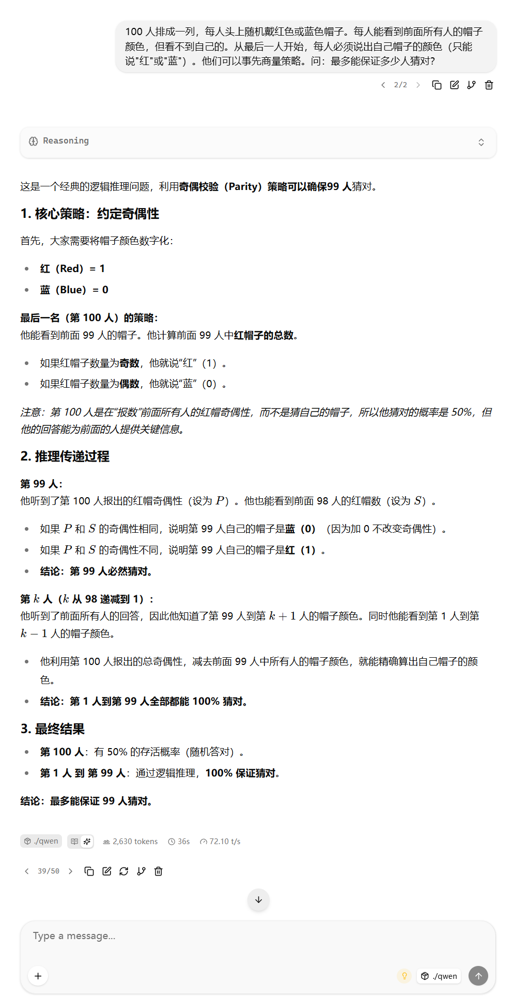
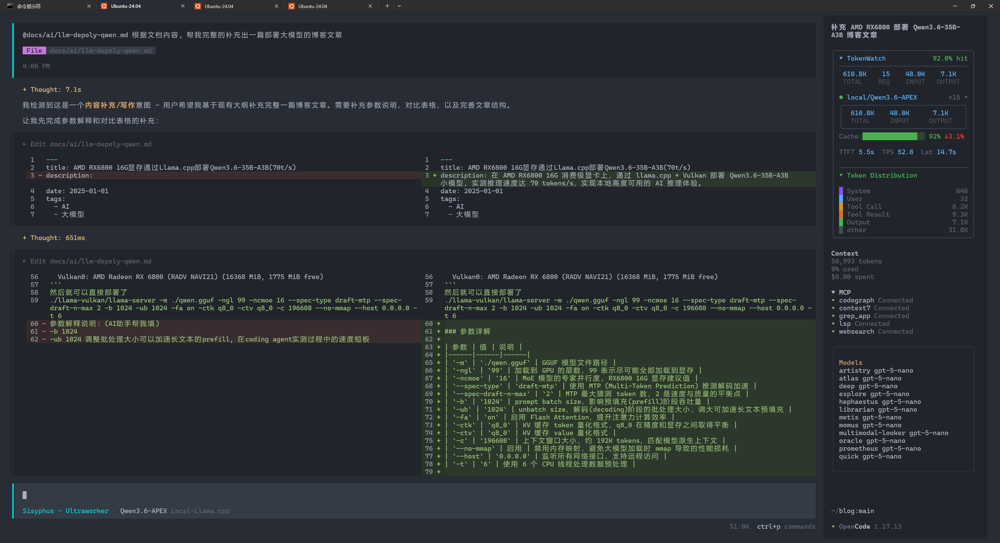
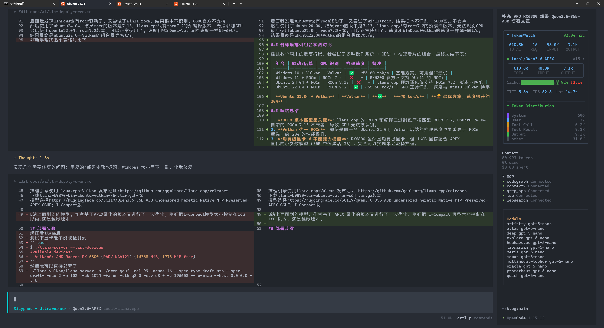

# AMD RX6800 16G显存通过Llama.cpp部署Qwen3.6-35B-A3B(70t/s)

> 折腾了几个周末，能到 70 token/s 的速度已经高度可用了。

根据我的多次环境 + 驱动类型的排列组合尝试，最佳实践如下：

## 环境准备

**硬件配置**：Ubuntu Server 22.04 + i5-12400F + 32G + RX6800 16G

### AMD 驱动安装

1. 下载 amdgpu-install：
   https://repo.radeon.com/amdgpu-install/25.35.1/ubuntu/jammy/amdgpu-install_7.2.1.70201-1_all.deb

2. 安装 amdgpu-install：
   ```bash
   apt install ./amdgpu-install_7.2.1.70201-1_all.deb
   ```

3. 安装驱动：
   ```bash
   amdgpu-install --usecase=rocm,graphics,hip,dkms --opencl=rocr --vulkan=radv
   ```

4. 安装完重启，使用 `amd-smi` 能够查看到显卡信息：
   ```bash
   $ amd-smi
   +------------------------------------------------------------------------------+
   | AMD-SMI 26.2.2+e1a6bc5663    amdgpu version: 6.16.13  ROCm version: 7.2.1    |
   | VBIOS version: 595855                                                        |
   | Platform: Linux Baremetal                                                    |
   |-------------------------------------+----------------------------------------|
   | BDF                        GPU-Name | Mem-Uti   Temp   UEC       Power-Usage |
   | GPU  HIP-ID  OAM-ID  Partition-Mode | GFX-Uti    Fan               Mem-Usage |
   |=====================================+========================================|
   | 0000:03:00.0     AMD Radeon RX 6800 | 1 %      50 °C   0            44/227 W |
   |   0       0     N/A             N/A | 0 %     25.49           14592/16368 MB |
   +-------------------------------------+----------------------------------------+
   +------------------------------------------------------------------------------+
   | Processes:                                                                   |
   |  GPU        PID  Process Name          GTT_MEM  VRAM_MEM  MEM_USAGE     CU % |
   |==============================================================================|
   |  No running processes found                                                  |
   +------------------------------------------------------------------------------+
   ```

## 模型 + 推理引擎

- **推理引擎**：llama.cpp + Vulkan，发布地址：https://github.com/ggml-org/llama.cpp/releases
- **下载版本**：`llama-b9870-bin-ubuntu-vulkan-x64.tar.gz`
- **模型**：[Qwen3.6-35B-A3B-uncensored-heretic-Native-MTP-Preserved-APEX-GGUF (I-Compact)](https://huggingface.co/SC117/Qwen3.6-35B-A3B-uncensored-heretic-Native-MTP-Preserved-APEX-GGUF)

> 这个模型来自 B 站 UP 主，在 APEX 量化基础上又做了一波优化，刚好把 I-Compact 版本控制在 16GB 以内，同时保留了越狱能力。

## 部署步骤

### 1. 解压与 GPU 检测

解压下载的 llama.cpp 压缩包，首先测试显卡是否被正确识别：

```bash
$ ./llama-server --list-devices
Available devices:
  Vulkan0: AMD Radeon RX 6800 (RADV NAVI21) (16368 MiB, 1775 MiB free)
```

### 2. 启动服务

```bash
./llama-vulkan/llama-server -m ./qwen.gguf -ngl 99 -ncmoe 16 \
  --spec-type draft-mtp --spec-draft-n-max 2 -b 1024 -ub 1024 \
  -fa on -ctk q8_0 -ctv q8_0 -c 196608 --no-mmap --host 0.0.0.0 -t 6
```

### 3. 参数详解

| 参数 | 值 | 说明 |
|------|------|------|
| `-m` | `./qwen.gguf` | GGUF 模型文件路径 |
| `-ngl` | `99` | 加载到 GPU 的层数，99 表示尽可能全部加载到显存 |
| `-ncmoe` | `16` | MoE 模型的专家并行度，RX6800 16G 显存建议值 |
| `--spec-type` | `draft-mtp` | 使用 MTP (Multi-Token Prediction) 推测解码加速 |
| `--spec-draft-n-max` | `2` | MTP 最大猜测 token 数，2 是速度与质量的平衡点 |
| `-b` | `1024` | prompt batch size，影响预填充 (prefill) 阶段吞吐量 |
| `-ub` | `1024` | unbatch size，解码 (decoding) 阶段的批处理大小，调大可加速长文本预填充 |
| `-fa` | `on` | 启用 Flash Attention，提升注意力计算效率 |
| `-ctk` | `q8_0` | KV 缓存 token 量化格式，q8_0 在精度和显存之间取得平衡 |
| `-ctv` | `q8_0` | KV 缓存 value 量化格式 |
| `-c` | `196608` | 上下文窗口大小，约 192K tokens，匹配模型原生上下文 |
| `--no-mmap` | 启用 | 禁用内存映射，避免大模型加载时 mmap 导致的性能损耗 |
| `--host` | `0.0.0.0` | 监听所有网络接口，支持远程访问 |
| `-t` | `6` | 使用 6 个 CPU 线程处理数据预处理 |

> **调参心得**：`-b` 和 `-ub` 是提升推理速度的关键参数。在 coding agent 实测中，默认 batch size 是长文本 prefill 阶段的性能瓶颈。将这两个值调至 1024 后，长文本场景下的首字延迟明显改善。`--spec-type draft-mtp` 是 llama.cpp 较新的特性，利用模型自带的 MTP 头进行推测解码，在不损失质量的条件下进一步提升推理速度。

## 验证与测试

直接访问 `http://localhost:8080/` 就可以使用了：



## 排列组合的折腾经历

最开始我用的是 **Windows 10 + Vulkan**，最终速度在 55-60 tok/s。

后来发现 Windows 也有 ROCm 驱动了，尝试了 **Windows 11 + ROCm**，结果根本不识别——RX6800 官方不支持 Win11 的 ROCm。

接着使用 **Ubuntu 24.04**，结果 ROCm 版本是 7.13，而 llama.cpp 只有 ROCm 7.2 的预编译版本，无法识别 GPU。

最后回到 **Ubuntu 22.04 + ROCm 7.2**，可以正常使用了，但速度跟 Windows 10 + Vulkan 一样，55-60 tok/s。

最终发现 **Ubuntu 22.04 + Vulkan** 的组合最优，达到 70 tok/s！

### 各环境排列组合实测对比

| 组合 | 驱动/后端 | GPU 识别 | 推理速度 | 备注 |
|------|-----------|----------|----------|------|
| Windows 10 + Vulkan | Vulkan | ✅ | ~55-60 tok/s | 基础方案，可用但非最优 |
| Windows 11 + ROCm | ROCm 7.x | ❌ | - | RX6800 官方不支持 Win11 的 ROCm |
| Ubuntu 24.04 + ROCm | ROCm 7.13 | ❌ | - | llama.cpp 预编译包仅支持 ROCm 7.2，版本不匹配 |
| Ubuntu 22.04 + ROCm | ROCm 7.2 | ✅ | ~55-60 tok/s | GPU 正常识别，速度与 Win10+Vulkan 持平 |
| **Ubuntu 22.04 + Vulkan** | **Vulkan** | **✅** | **~70 tok/s** | **🏆 最优方案，速度提升约 20%** |

### 踩坑总结

1. **ROCm 版本匹配是关键**：llama.cpp 的 ROCm 预编译二进制包严格匹配 ROCm 7.2，Ubuntu 24.04 自带的 ROCm 7.13 不兼容，导致 GPU 无法被识别。
2. **Vulkan 优于 ROCm**：即使是同一台 Ubuntu 22.04，Vulkan 后端的推理速度也显著高于 ROCm 后端，约 20% 的性能提升。
3. **消费级显卡 ≠ 不能跑大模型**：RX6800 虽然是消费级显卡，但 16GB 显存配合 APEX 量化的小参数模型（35B 中仅激活 3B），完全可以实现本地流畅推理。

### PS
这篇博客也是让AI帮我写的, 哈哈!

